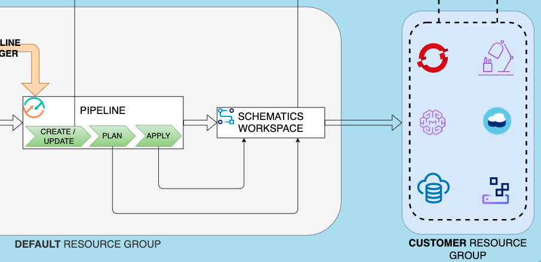
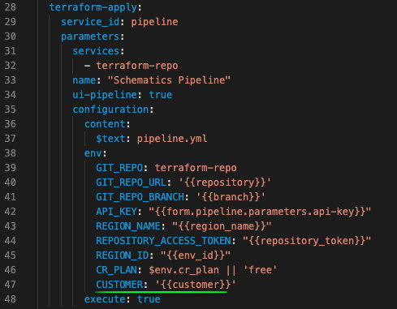

# Automated Infrastucture Deployment, 
## An IaC Toolchain CI/CD Deployment

This repository is an example of how you can create a full CI/CD cloud architecture with only 1 click.


## 0. Pre-requisites
In order to use this tool, it is needed:
- IBM Cloud account admin permissions
- IBM Cloud account API key
- GitHub repository
- GitHub Personal Access Token

## 1. Repository structure
The repo must contain at least the following three folders:
1. [.bluemix](./.bluemix): Toolchain configuration files.
2. [schematics](./schematics): Schematics config file & initial values of terraform variables.
3. [terraform](./terraform): Cloud objects to be created.

## 2. Toolchain creation
You can create this entire architecture with only 1 click.
The only thing you must do is fill the following **URL** with the specific params of your project:
```
https://cloud.ibm.com/devops/setup/deploy?env_id=ibm:yp:<IBM-REGION>
&region_name=<IBM-REGION>
&repository=<INFRASTRUCTURE-REPO-URL>
&branch=<INFRASTRUCTURE-REPO-BRANCH>
&repository_token=<INFRASTRUCTURE-REPO-TOKEN>
&apiKey=<IBM-API-KEY>
&toolchain_name=<TOOLCHAIN-NAME>
&source_provider=<IBM-GIT-PROVIDER>
&type=<IBM-GIT-PROVIDER-TYPE>
&customer=<CUSTOMER-NAME>
```

- **IBM-REGION**: Region where you want to deploy every objects -> ```$ ibmcloud regions```
- **INFRASTRUCTURE-REPO-URL**: URL of the Git infrastructure repo -> ```https://github.ibm.com/tech-garage-spgi/infra-repo```
- **INFRASTRUCTURE-REPO-BRANCH**: ```master```/```release```/```develop```,...
- **INFRASTRUCTURE-REPO-TOKEN**: Access token to Git repo. [Create GitHub Personal Access Token](https://github.ibm.com/settings/tokens).
- **IBM-API-KEY**: Access token to IBM account. [Create IBM API Key](https://cloud.ibm.com/iam/apikeys).
- **TOOLCHAIN-NAME**: Name for the new toolchain resource.
- **IBM-GIT-PROVIDER**: Git access object -> ```github_integrated``` for **GitHub**, ```hostedgit``` for **GitLab**.
- **IBM-GIT-PROVIDER-TYPE**: Type of repo -> ```link``` for **Existing**.
- **CUSTOMER-NAME**: Prefix name for every new cloud objects.


This procedure will access to the [.bluemix folder](./.bluemix) in the repo, to read the Toolchain config file [toolchain.yml](./.bluemix/toolchain.yml) and show you a toolchain creation web completely filled, waiting only a human action to confirm:


In this particular case it is configured to create a toolchain with two elements:
1. Access to **GitHub repo** and detect new commits.
2. **Pipeline**, trigered by a commit in the repo.

## 3. Pipeline

The pipeline is where the actions over the cloud will be performed. It is trigered by a commit in the repo, and it perform three chained actions sequentially:
   1. Create/Update an **Schematics** workspace: Applies changes found in [./schematics/initial.json](./schematics/initial.json)
   2. Create an execution **Plan** for that schematics workspace: Plan changes found in [./terraform folder](./terraform)
   3. **Apply** the execution plan of the schematics workspace: Apply changes previously planed.

When the execution plan is applied by **Schematics**, it creates all the clould objects specified inside [./terraform folder](./terraform):



## BONUS TRACK: How to inject variables from URL params to Terraform templates 

As everything is automated, and human intervention is almost non-existent, a very common question is **How to enter a value to be applied to some terraform objects?*

To do that, you have to perform the following steps:

1. Declare the schematics variable inside [terraform variables.tf file](./terraform/variables.tf) and use it in any other [terraform file](./terraform) to create cloud objects.
2. Insert variable and value inside the Toolchain creation URL with the format ```&newvar=newValue``` :
   ```https://cloud.ibm.com/devops/...&customer=myCustomer```
3. Inside [Toolchain file](./.bluemix/toolchain.yml) pass the variable as a env-var to the **pipeline** service:

4. Inside [Pipeline file](./.bluemix/pipeline.yml):
   1. Declare input variable in ```properties```section.
   2. Define ***placeholder string*** inside [Schematics file](./schematics/initial.json) to be substituted.
   3. Use the variable inside any **script** stage to substitute every occurence of a ***placeholder string*** in the [Schematics file](./schematics/initial.json):
   ```sed -i "s/region_placeholder/$REGION_NAME/g" ./schematics/initial.json```
