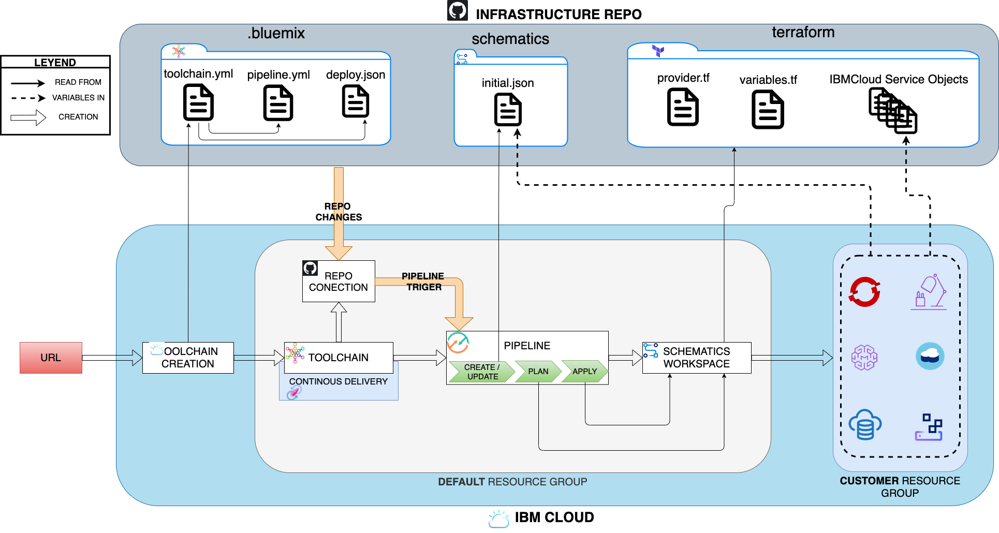
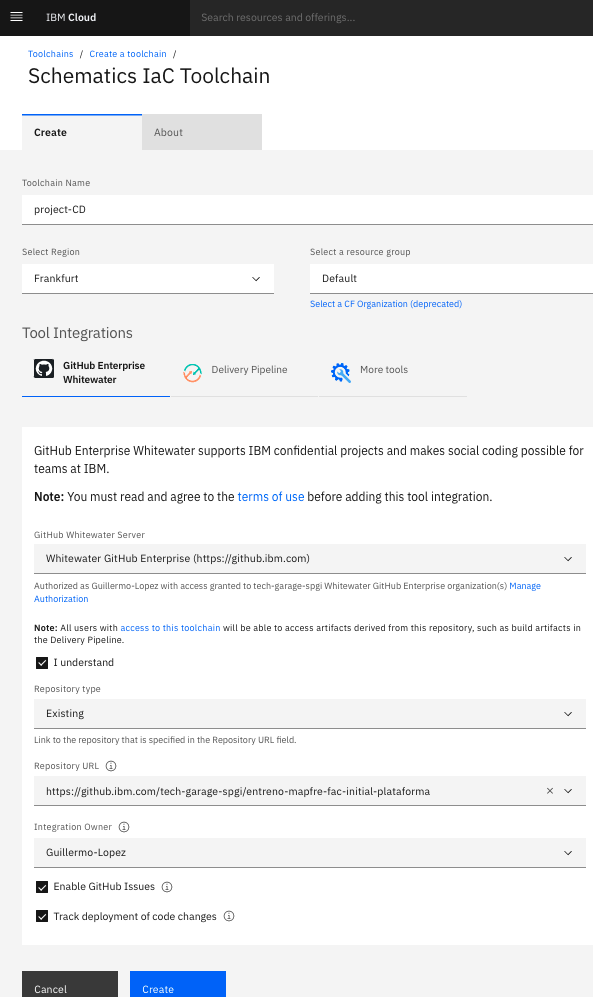

# IaC Toolchain CI/CD Deployment

This repository is an example of how you can create a full CI/CD cloud architecture with only 1 click.



## 0. Repository structure
The repo must contain at least the following three folders:
1. [.bluemix](./.bluemix): Toolchain configuration files.
2. [schematics](./schematics): Schematics config file & initial values of terraform variables.
3. [terraform](./terraform): Cloud objects to be created.
## 1. Toolchain creation
You can create this entire architecture with only 1 click.
The only thing you must do is fill the following **URL** with the specific params of your project:
```
https://cloud.ibm.com/devops/setup/deploy?env_id=ibm:yp:<IBM-REGION>
&region_name=<IBM-REGION>
&repository=<INFRASTRUCTURE-REPO-URL>
&branch=<INFRASTRUCTURE-REPO-BRANCH>
&repository_token=<INFRASTRUCTURE-REPO-TOKEN>
&apiKey=<IBM-API-KEY>
&toolchain_name=<TOOLCHAIN-NAME>
&source_provider=<IBM-GIT-PROVIDER>
&type=<IBM-GIT-PROVIDER-TYPE>
&customer=<CUSTOMER-NAME>
```

- **IBM-REGION**: Region where you want to deploy every objects -> ```$ ibmcloud regions```
- **INFRASTRUCTURE-REPO-URL**: URL of the Git infrastructure repo -> ```https://github.ibm.com/tech-garage-spgi/infra-repo```
- **INFRASTRUCTURE-REPO-BRANCH**: ```master```/```release```/```develop```,...
- **INFRASTRUCTURE-REPO-TOKEN**: Access token to Git repo. [Create GitHub Personal Access Token](https://github.ibm.com/settings/tokens).
- **IBM-API-KEY**: Access token to IBM account. [Create IBM API Key](https://cloud.ibm.com/iam/apikeys).
- **TOOLCHAIN-NAME**: Name for the new toolchain resource.
- **IBM-GIT-PROVIDER**: Git access object -> ```github_integrated``` for **GitHub**, ```hostedgit``` for **GitLab**.
- **IBM-GIT-PROVIDER-TYPE**: Type of repo -> ```link``` for **Existing**.
- **CUSTOMER-NAME**: Prefix name for every new cloud objects.


This procedure will access to the [.bluemix folder](./.bluemix) in the repo, to read the Toolchain config file [toolchain.yml](./.bluemix/toolchain.yml) and show you a toolchain creation web completely filled, waiting only a human action to confirm:


In this case it is configured to create a toolchain with two elements:
1. Access to **GitHub repo** and detect new commits.
2. **Pipeline**, trigered by a commit in the repo, which is composed by three stages:
   1. Create/Update an **Schematics** workspace.
   2. Create an execution **Plan** for that schematics workspace.
   3. **Apply** the execution plan of the schematics workspace.

## 2. Pipeline
When the execution plan is applied by the pipeline, it creates all the clould objects specified inside ```terraform```folder.

